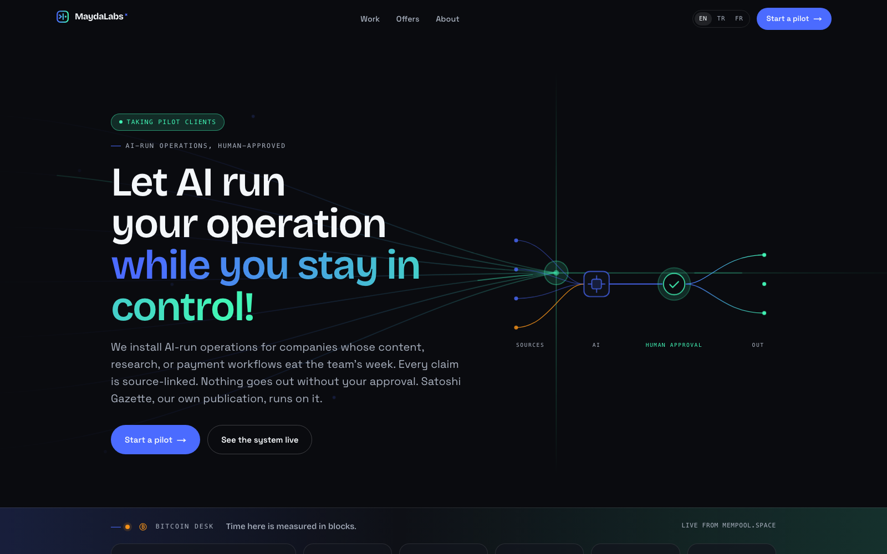
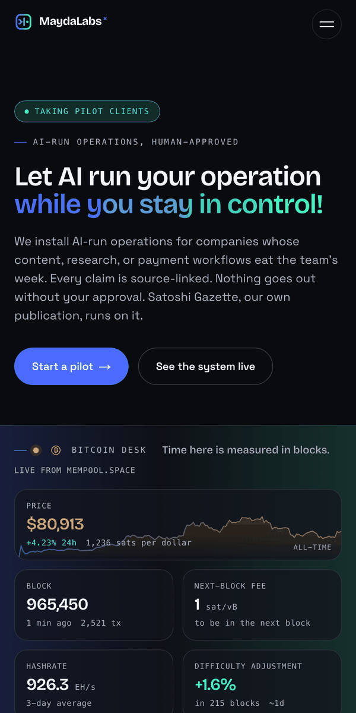
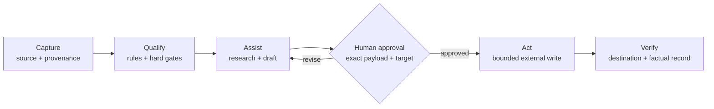
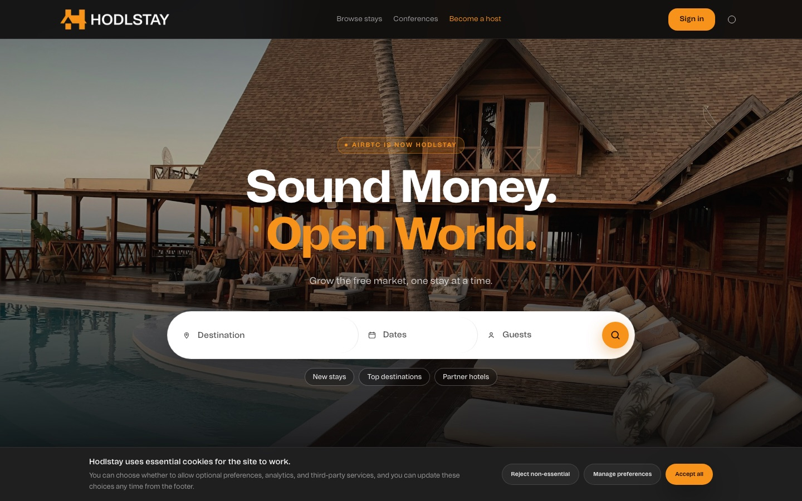
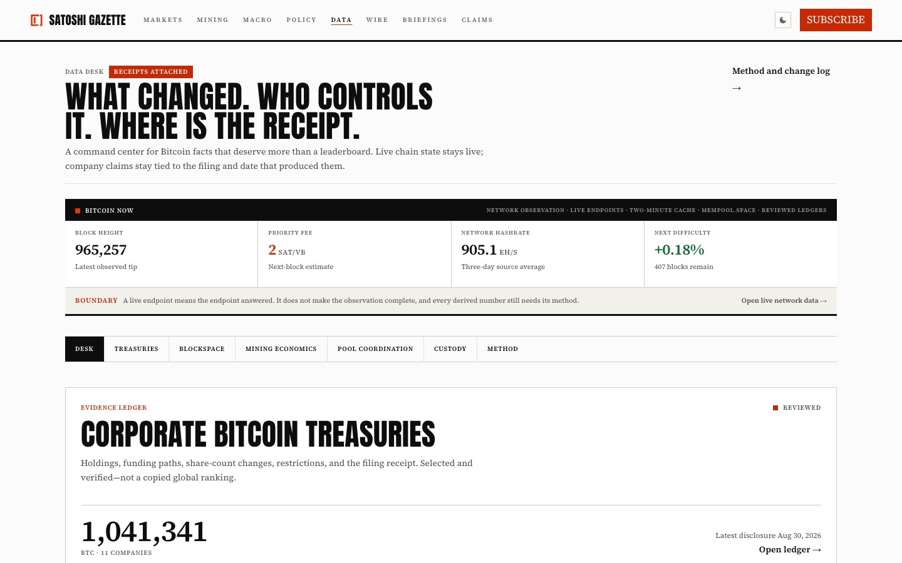

# MaydaLabs

**AI-run operations, you stay in control.**

MaydaLabs installs AI operating systems that run real business workflows, with
a human approval gate on every action that leaves the system. Built and
operated by [Mehmet E. Mayda](https://maydalabs.com/profile) from Istanbul.

Two offers, both already running in production:

| Offer | What it is | Proof |
| --- | --- | --- |
| **Evidence-gated AI operations** | Pick the workflow. We install the system. Pilot from $2,500, three to four weeks, then from $1,000 a month. | [Satoshi Gazette](https://satoshigazette.org) runs on it, publicly. |
| **Bitcoin payments engineering** | Scoped, fixed-price engagements. | [HodlStay](https://hodlstay.com)'s production payment system, built end to end. |

Satoshi Gazette is the demo. A Bitcoin-only publication operated through the
system: not a mockup, not a pitch deck, a running business you can read right
now.

**[Founder profile](https://maydalabs.com/profile)** · **[Selected work](https://maydalabs.com/case-studies)** · **[What do you need?](https://maydalabs.com/contact)**





## What this repository is

The MaydaLabs platform: the public marketing surface, an authenticated client
portal, the pilot intake and review workflow, and an on-chain Bitcoin invoicing
path that takes payment without a processor and without a custodial server.

It is also the honest answer to "show me your code." Everything below is in
this repository and can be read rather than taken on trust.

## Where to look in this codebase

If you are here to judge the engineering rather than the studio, start with
these:

| Path | Why it is worth opening |
| --- | --- |
| `tests/rls.integration.test.ts` | Row-level security and grants exercised against a real local Supabase stack, through the real Data API, with real user sessions and negative cases. Not mocks. |
| `lib/payments.ts` | Invoice vocabulary and pure money helpers. Sats are rounded up so an invoice is never short of the price it quotes, and the module stays import-free so client components can render from it. |
| `lib/bitcoinAddress.ts` | Address checksum validation, run by the server action before anything is written. |
| `lib/supabase/` | Server and browser clients, typed against a generated database schema. |
| `lib/rateLimit.ts` | Rate limiting on the public intake path. |
| `lib/osSources.ts` | Fetching pages on behalf of a signed-in stranger is a server-side request forgery hole unless it is guarded. Every hostname is resolved before the request and anything private, loopback, or link-local is refused, redirects are not followed, and responses are capped and stripped to text. |
| `lib/osDraft.ts` | One model call, structured output, every claim returned beside the source it came from or explicitly beside nothing. A citation to a URL the model was never given is replaced with null before anything is stored, because a model naming a source it never read is not evidence. |
| `app/actions/os.ts` | A MaydaOS run end to end: gather the sources, draft, record the tokens and the dollar cost, and wait for a person to decide. |
| `app/[lang]/` | Localized routing and metadata composition across English, Turkish, and French. |
| `lib/i18n.ts`, `lib/metadata.ts` | Localization and metadata kept out of presentation. |
| `scripts/smoke.mjs` | Dependency-free production verification: routes, redirects, localized metadata, robots, sitemap, social images, and the public telemetry response. |

## Human-controlled automation

The same operating discipline appears in the private research, editorial, and
production systems around the public products. AI can help qualify evidence,
retrieve context, and prepare a draft, while exact consequential actions remain
behind a human approval gate and are verified after execution.



- Evidence and provenance travel with the record.
- Autonomous external writes are off by default.
- Application, publication, and outreach payloads stay reviewable before action.
- The system records what factually happened, rather than assuming success.

## Selected work

### HodlStay

A Bitcoin-native accommodation marketplace delivered as a client product build,
from product strategy and booking architecture through payments, localization,
SEO, analytics, lifecycle communication, and operational handover.

- [Visit HodlStay](https://hodlstay.com)
- [Read the case study](https://maydalabs.com/case-studies/hodlstay)

### Satoshi Gazette

A Bitcoin intelligence and publishing product combining source intake,
evidence-aware editorial workflows, wire and story production, briefings,
primary-evidence data desks, and approval-gated distribution. MaydaLabs owns
the product; the guarded Ask Satoshi retrieval foundation, newsroom tooling,
and operational data remain behind the public surface.

- [Visit Satoshi Gazette](https://satoshigazette.org)
- [Read the case study](https://maydalabs.com/case-studies/satoshi-gazette)

### Mortal Vault — private alpha

A self-custodial continuity vault with owner check-ins, delayed beneficiary
claims, an owner challenge window, event-backed history, and explicit security
release gates. Contracts are unaudited and must not hold meaningful funds.

- [Read the work-in-progress case](https://maydalabs.com/case-studies/mortal-vault)

### Sofra — private Phase 1

A Türkiye-first managed marketplace for scheduled dinners in verified
households. The product connects bilingual guest, host, and operator journeys
while keeping exact household and safety data out of public projections. It is
demo-safe and does not claim a public launch or real payments.

- [Read the work-in-progress case](https://maydalabs.com/case-studies/sofra)

## Product proof, side by side

<table>
  <tr>
    <td width="50%"></td>
    <td width="50%"></td>
  </tr>
  <tr>
    <td><strong>HodlStay</strong><br />Marketplace, payments, operations, lifecycle, and growth.</td>
    <td><strong>Satoshi Gazette</strong><br />Editorial UX, evidence, retrieval, publishing, and guarded distribution.</td>
  </tr>
</table>

## MaydaOS

MaydaOS is how MaydaLabs delivers and runs work for a client. It is not a
product for sale, a public destination, or a second brand: the name is
internal, and the thing itself is one section of the client's own portal.

A workflow is installed by hand for one client. It reads its own standing
sources, produces the piece, and attaches every claim to the source it came
from. Then it stops, because a person decides what leaves. Nothing is published
or sent by the system, ever; an approved draft records where its author put it.

- **`/portal`** is the whole client surface: work waiting for a decision, then
  their engagement and invoices, then their account. The work section renders
  nothing for a client without a workflow installed, so the portal is unchanged
  for everyone else.
- **`/portal/work`** is the full record — every run, what it cost, what was
  decided, and where it ended up. Rejected runs included.
- **`/internal/os`** is the operator's side: install a workflow, set its brief
  and its standing sources, and see what each one has spent this month.

The budget belongs to the workflow, not the person: one number per calendar
month, set by the operator, enforced against what that workflow's runs actually
cost. A global daily ceiling stands behind it. A run that fails is recorded and
costs nothing.

The reasoning, what was deleted, and the freeze rule that governs what happens
next are in [`docs/maydaos-direction-2026-09-09.md`](docs/maydaos-direction-2026-09-09.md).

## Architecture

```text
app/[lang]/       Localized pages, metadata, and route composition
app/[lang]/portal Authenticated client surface: work, engagement, account
app/api/          Public telemetry endpoint
components/       Interface, forms, diagrams, and case-study components
lib/              Payments, Bitcoin address validation, Supabase clients,
                  localization, metadata, analytics, and rate limiting
public/           Brand and case-study assets approved for public display
docs/             Product, launch, commercial, and brand documentation
scripts/          Dependency-free production verification
tests/            Vitest unit tests and the Supabase RLS integration suite
```

## Run locally

Requirements: a current Node.js LTS release and npm.

```bash
npm install
npm run dev
```

Open [http://localhost:3000](http://localhost:3000). Before a production
change, run:

```bash
npm run lint
npm run test
npm run build
npm run smoke:live
```

`smoke:live` checks production routes, redirects, localized metadata, robots,
the sitemap, social images, and the public telemetry response. Set
`SMOKE_BASE_URL` and `SMOKE_CANONICAL_URL` to inspect another deployment.

The RLS integration suite skips itself unless a local Supabase stack is
running. Start one with `npx supabase start` and provide the keys through
`.env.local` to exercise it.

The repository includes an environment-variable example file. Never commit
real credentials or private operational data.

## Evidence boundaries

- HodlStay is client work and is described only to the extent publicly approved.
- Satoshi Gazette is a MaydaLabs product; its internal newsroom runtime and automation remain private.
- Mortal Vault is an unaudited private alpha; no mainnet readiness or meaningful-funds claim is made.
- Sofra is a private Phase 1 build; demo records are not represented as real people, bookings, or payments.
- Case-study language distinguishes shipped work from planned or ongoing work.
- No client secret, credential, private dataset, or application record belongs in this repository.

## Contact

- [MaydaLabs](https://maydalabs.com)
- [LinkedIn](https://www.linkedin.com/in/mehmet-e-mayda/)
- [Email](mailto:info@maydalabs.com)

## License

Released under the [MIT License](LICENSE). The brand assets under
`public/logos/`, `public/profile/`, and `docs/brand/` are not covered by it.
