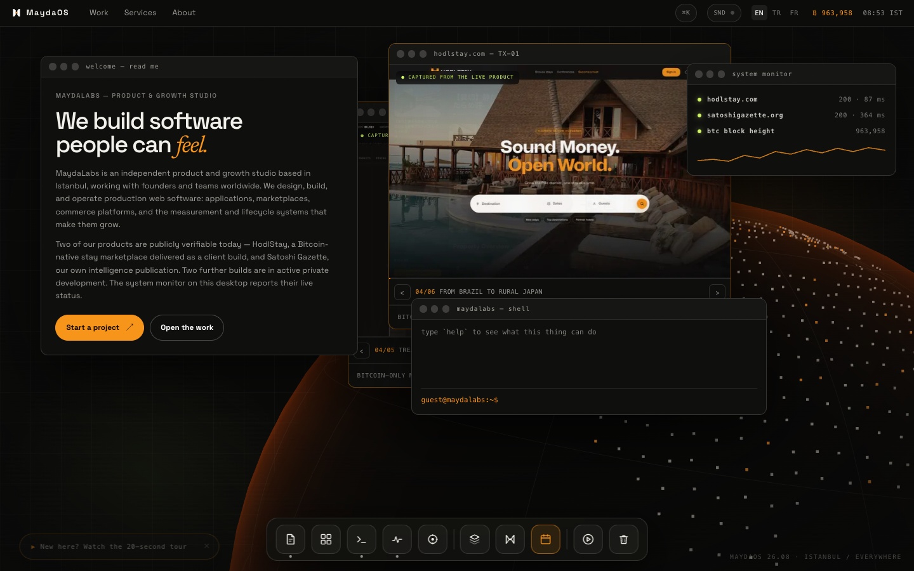
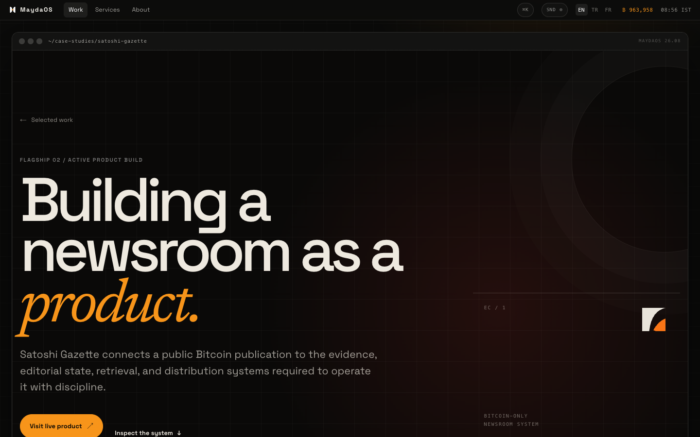
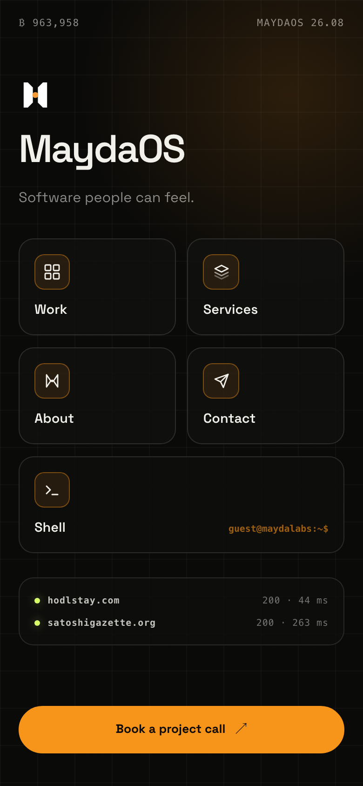
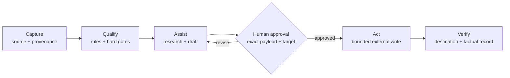
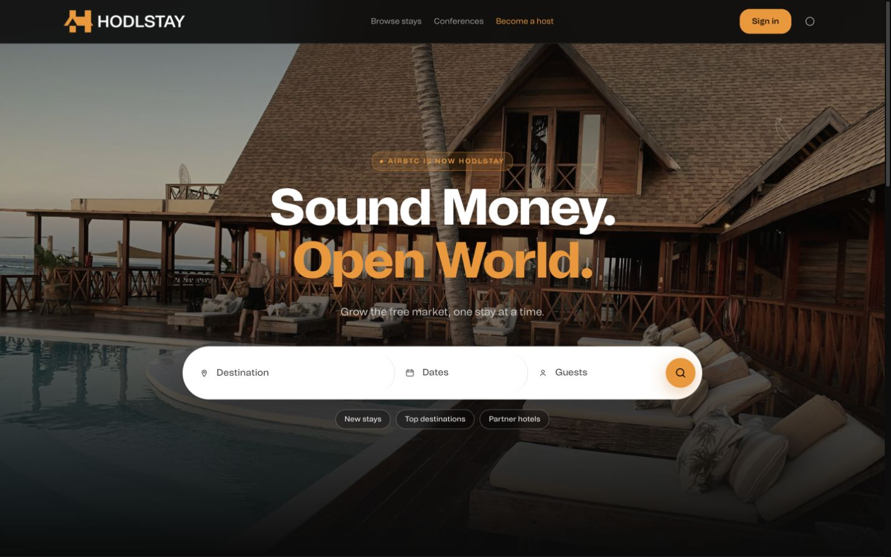
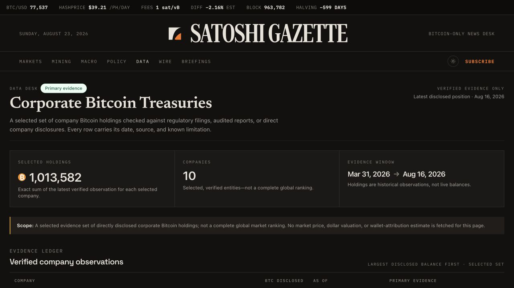

# MaydaLabs

I’m Mehmet E. Mayda, the founder and full-stack product builder behind
[MaydaLabs](https://maydalabs.com).

I build production web products and the systems around them: product flows,
marketplaces, payments, lifecycle email, analytics, technical SEO,
localization, content operations, and AI-assisted workflows with deliberate
human control.

This repository contains the MaydaLabs studio site. It is both the public home
of the studio and a compact example of how I approach product engineering:
clear positioning, multilingual information architecture, strong technical
foundations, measurable user journeys, and careful evidence boundaries.

**[Founder profile](https://maydalabs.com/profile)** · **[Selected work](https://maydalabs.com/case-studies)** · **[What do you need?](https://maydalabs.com/contact)**

## MaydaOS

The site runs as a small operating system, and everything on it is
functional rather than decorative:



<table>
  <tr>
    <td width="66%"></td>
    <td width="34%"></td>
  </tr>
</table>

- Draggable, snappable windows with a persisted desktop layout, a dock,
  a menubar, and a ⌘K command palette
- A guided command shell: `idea` and `problem` turn three rough answers into
  a local project draft, `review` hands that draft to the contact composer,
  and `meet` opens the 30-minute calendar; `proof` pings the studio's shipped
  products, `wallpaper` switches scenes, and `tour` drives the real UI with a
  ghost cursor that yields the moment a human touches anything
- Live telemetry: the system monitor and the menubar block ticker read
  from the products and mempool.space; a newly mined Bitcoin block
  fires a toast and a wallpaper surge
- A wallpaper engine with ten three.js scenes behind one interface —
  the default is a node planet whose transaction arcs pace themselves
  from real mempool pressure
- Product windows play reels captured from the live products
- Synthesized WebAudio interface sound (opt-in), three languages,
  full reduced-motion support, and Lighthouse 92+ mobile / 97 desktop
  with zero layout shift

## Selected work

### HodlStay

A Bitcoin-native accommodation marketplace delivered as a client product
build, from product strategy and booking architecture through payments,
localization, SEO, analytics, lifecycle communication, and operational
handover.

- [Visit HodlStay](https://hodlstay.com)
- [Read the case study](https://maydalabs.com/case-studies/hodlstay)

### Satoshi Gazette

A Bitcoin intelligence and publishing product combining source intake,
evidence-aware editorial workflows, wire and story production, briefings,
primary-evidence data desks, and approval-gated distribution. MaydaLabs owns
the product; the guarded Ask Satoshi retrieval foundation, newsroom tooling,
and operational data remain behind the public surface.

- [Visit Satoshi Gazette](https://satoshigazette.org)
- [Read the case study](https://maydalabs.com/case-studies/satoshi-gazette)

### Mortal Vault — private alpha

A self-custodial continuity vault with owner check-ins, delayed beneficiary
claims, an owner challenge window, event-backed history, and explicit security
release gates. Contracts are unaudited and must not hold meaningful funds.

- [Read the work-in-progress case](https://maydalabs.com/case-studies/mortal-vault)

### Sofra — private Phase 1

A Türkiye-first managed marketplace for scheduled dinners in verified
households. The product connects bilingual guest, host, and operator journeys
while keeping exact household and safety data out of public projections. It is
demo-safe and does not claim a public launch or real payments.

- [Read the work-in-progress case](https://maydalabs.com/case-studies/sofra)

## What this codebase demonstrates

- Next.js App Router, React, TypeScript, and component-driven UI
- An event-driven interface layer: windows, shell, palette, tour, and
  wallpapers coordinate over a small CustomEvent bus
- three.js scenes behind one scene interface, loaded dynamically and
  capped at 30 fps so ambience never taxes the page
- English, Turkish, and French routing with localized metadata
- Structured data, canonical URLs, sitemap, robots, and OS-styled social cards
- Vercel Analytics, Speed Insights, and conversion-path instrumentation,
  including interface events that carry state ids and never typed input
- Explicit separation between public proof and private client or operational data

## Human-controlled automation

The same operating discipline appears in the private research, editorial, and
production systems around the public products. AI can help qualify evidence,
retrieve context, and prepare a draft, while exact consequential actions remain
behind a human approval gate and are verified after execution.



- Evidence and provenance travel with the record.
- Autonomous external writes are off by default.
- Application, publication, and outreach payloads stay reviewable before action.
- The system records what factually happened, rather than assuming success.

## Product proof, side by side

<table>
  <tr>
    <td width="50%"></td>
    <td width="50%"></td>
  </tr>
  <tr>
    <td><strong>HodlStay</strong><br />Marketplace, payments, operations, lifecycle, and growth.</td>
    <td><strong>Satoshi Gazette</strong><br />Editorial UX, evidence, retrieval, publishing, and guarded distribution.</td>
  </tr>
</table>

## Architecture

```text
app/[lang]/       Localized pages, metadata, and route composition
components/       Shared navigation, analytics, and interface components
components/os/    MaydaOS: windows, shell, wallpaper engine, tour, telemetry
lib/              Localization, metadata, analytics, and marketing-link helpers
public/           Brand and case-study assets approved for public display
docs/             Supporting product, launch, and awards documentation
scripts/          Dependency-free production verification
```

## Run locally

Requirements: a current Node.js LTS release and npm.

```bash
npm install
npm run dev
```

Open [http://localhost:3000](http://localhost:3000). Before a production
change, run:

```bash
npm run lint
npm run build
npm run smoke:live
```

`smoke:live` checks production routes, redirects, localized metadata, robots,
the sitemap, social images, and the public telemetry response. Set
`SMOKE_BASE_URL` and `SMOKE_CANONICAL_URL` to inspect another deployment.

The repository includes an environment-variable example file. Never commit
real credentials or private operational data.

## Evidence boundaries

- HodlStay is client work and is described only to the extent publicly approved.
- Satoshi Gazette is a MaydaLabs product; its internal newsroom runtime and automation remain private.
- Mortal Vault is an unaudited private alpha; no mainnet readiness or meaningful-funds claim is made.
- Sofra is a private Phase 1 build; demo records are not represented as real people, bookings, or payments.
- Case-study language distinguishes shipped work from planned or ongoing work.
- No client secret, credential, private dataset, or application record belongs in this repository.

## Contact

- [MaydaLabs](https://maydalabs.com)
- [LinkedIn](https://www.linkedin.com/in/mehmet-e-mayda/)
- [Email](mailto:info@maydalabs.com)

This repository is presented as a portfolio artifact. No open-source license
is granted unless a `LICENSE` file is added explicitly.
